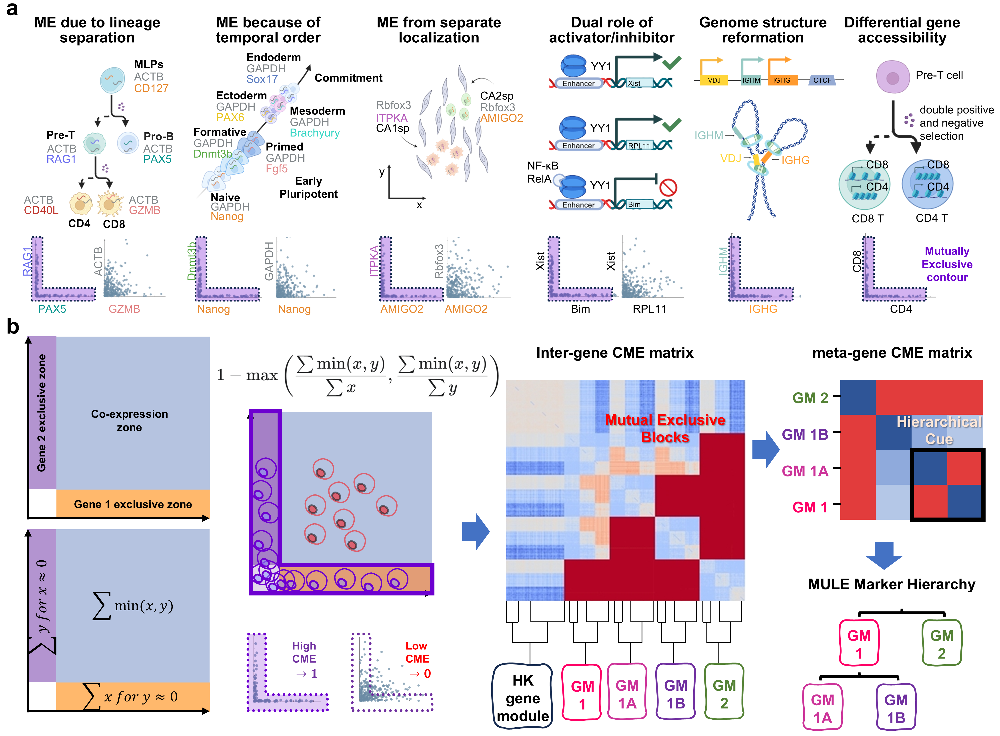

# MULE

MULE (**Mutual Exclusion in scRNA-seq**) is a tool for detecting mutually exclusive gene expression patterns in single-cell RNA-seq and spatial transcriptomics data.

We recommend using a GPU to calculate the mutual exclusivity score.

  
*Illustration: Mutual Exclusivity in Biology and the MULE Workflow.*


## Features
- Calculate gene–gene mutual exclusivity scores
- Support for single-cell and spatial transcriptomics datasets
- Compatible with [Scanpy]`AnnData` format
- Statistical significance testing with FDR correction
- Gene module hierarchical structure 
- Mutual-Exclusion-Enhanced Metric Learning

## Installation
It is recommended to create a dedicated Conda environment.
```
conda create -n mule python=3.10 -y
conda activate mule

pip install numpy>=2.2.6 pandas>=2.3.2 scanpy>=1.11.4 numba>=0.61.2 networkx>=3.4.2 treelib>=1.7.1

```
Install PyTorch and MULE
```
pip install torch torchvision torchaudio --index-url https://download.pytorch.org/whl/cu121
conda install -c steven_cai mule
```


## Usage

```
import scanpy as sc
import mule as mu

adata = sc.read_h5ad("your_data.h5ad")
mu.tax.mutually_exclusively_detect_CME(adata)
```
Example data can be downloaded from [here](https://drive.google.com/drive/folders/1W74jxH_fQ-qD5MCvwNSP_605JWC6SCQb?usp=sharing).

For detailed usage, please refer to test_code_gpu.ipynb.

## Output
The results are stored in `adata.uns['mule']`.

## License
This project is licensed under the MIT License.  

